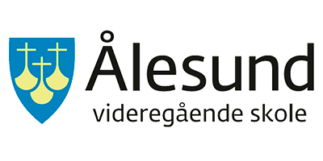
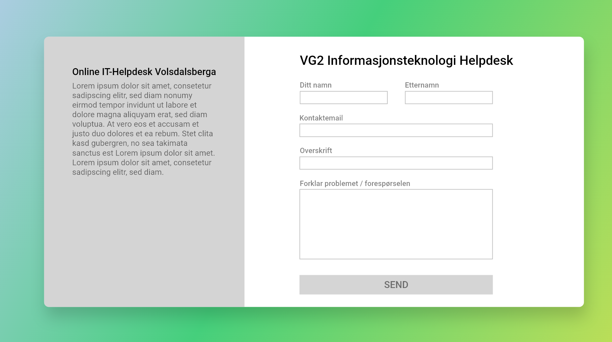

# 2IT Online Helpdesk / IT-Support Service
A project made to allow people at Ålesund Vidaregåande Skule (Upper primary school of Ålesund) to submit IT / computer related support tickets. It has a front-end for the end users (branch: frontend), a backend part that tackles the sql and emailing part of things (branch: backend) and a GUI based dashboard that is made to make it easier for people to answer the tickets (branch: dashboard)

 
 
 

#### Logo source: [Click](https://www.facebook.com/AAVGS/)

 
 
 

## Technologies, services and software used:
### Technologies:
    - NodeJS (Backend, Sending emails, Handling SQL queries)
    - HTML, CSS and JS (End-user frontend as well as dashboard GUI)
    - SQL (Query language used)
    - Tailwind (CSS Framework)
### Services:
    - Hostinger (Hosting for both the dashboard and the end-user frontend)
    - Amazon Web Services (Backend hosting)
### Software:
    - Visual Studio Code (Main code editor)
    - Adobe XD (UI design)
    - Photoshop (Small logo tweaks, background removal etc.)
    - Postman (Early development stage debugging of POST requests)

 
 
 

## Design example:

 

### End-user front page:

 

> 

 
 
 

## Official contributors
- Arseni Skobelev (GitHub user: [ArseniSkobelev](https://github.com/ArseniSkobelev))
- Oliver Stene (GitHub user: [NUB31](https://github.com/NUB31))
